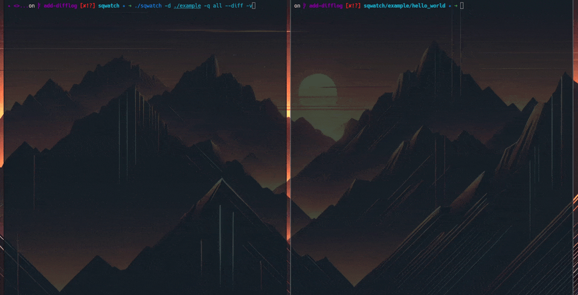

# SQWatch

*A Simple File System Event Watcher*

A lightweight tool that monitors file system events (create, modify, delete) and executes commands in response to these changes.

## Overview

SQWatch monitors specified files or directories for quality changes (such as modifications, creation, or deletion) and triggers custom commands when these changes are detected. It's designed to be simple, efficient, and easy to integrate into development workflows.



## Features

- File and directory monitoring
- Custom command execution
- Low resource footprint
- Simple integration with build tools

## Dependencies

SQWatch requires:
- Linux kernel with inotify support
- GCC or compatible C compiler
- GNU Make

For Nix users, all dependencies are handled automatically through the nix-shell environment.

## Installation

If using Nix:

```bash
git clone https://github.com/cloudripper/sqwatch.git
cd sqwatch
nix-shell
```

If using make:

```bash
# Clone the repository
git clone https://github.com/cloudripper/sqwatch.git
cd sqwatch

# Build the project
make

# Install the binary to your path
sudo install -D ./sqwatch /usr/local/bin/sqwatch
```

## Usage

Basic syntax:
```bash
sqwatch [-d directory] [-f file] -q event -c command
```

Options:
- `-d directory`: Directory to watch
- `-f file`: File to watch
- `-q event`: Event type to watch
  - `all`: all events
  - `modify`: file modifications
  - `create`: file creation
  - `delete`: file deletion
  - `move`: file moves
  - `attrib`: attribute changes
- `-c command`: Command to execute when events are detected
- `-h`: Display help message

Examples:
```bash
# Watch a file for modifications and run a command
sqwatch -f main.c -q modify -c "gcc main.c -o program && ./program"

# Watch a directory for any changes and run tests
sqwatch -d src/ -q all -c "make test"
```


## Contributing

Contributions are always welcome. Feel free to submit issues and pull requests.

